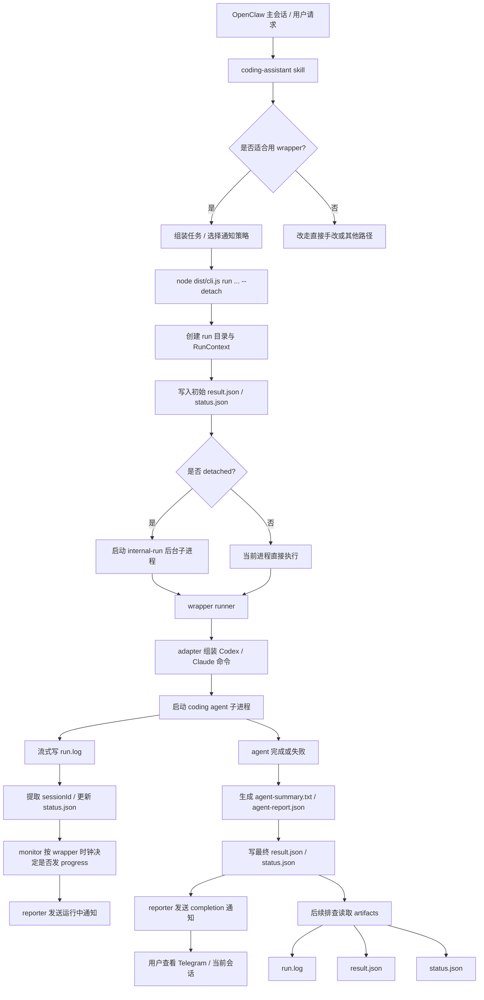

# coding-agent-wrapper

一个尽量小、可运行、可扩展的通用 coding agent wrapper。第一版目标不是做服务平台，而是提供一个统一 CLI，把不同编程代理包装成一致的“后台任务执行单元”，统一处理：

- 启动参数
- 后台运行
- 日志落盘
- 结果 JSON 落盘
- 完成通知

当前第一版优先把 `Codex` 支持做好，同时给 `Claude Code` 留出清晰适配位。

## 为什么它服务于“模式 B”

这里将“模式 B”具体化为一种简单工作模式：

- 人或上层脚本发起一次编码任务
- 任务在后台持续运行，不要求人一直盯着终端
- 任务过程写日志，结果写结构化 JSON
- 完成后只通过轻量通知唤醒人
- 细节查看走日志和结果文件，而不是把通知通道塞满

这个仓库的第一版正是围绕这组需求设计：通知通道与结果通道分离，适合作为更大自动化流程中的一个基础执行块。

## 运行流程图



## 当前能力

- 支持统一 CLI 参数：`agent`、`cwd`、`task`、`label`
- 支持 `--detach` 后台运行
- 支持 `codex` 适配
  - `CODEX_API_KEY` 从运行环境或 `openclaw.json -> skills.entries.coding-assistant.env` 读取
  - 默认附加 `--dangerously-bypass-approvals-and-sandbox`
- 支持 `claude` 适配骨架
  - 已实现命令拼装
  - 已实现运行、日志、结果落盘流程
  - 第一版主要定位为结构预留与本机命令接入点
- 自动写入：
  - `run.log`
  - `result.json`
  - `status.json`
  - `agent-summary.txt`（若底层 agent 显式输出/写入）
- 任务结束后自动通知：
  - 外部聊天渠道优先走 `openclaw message send`
  - session / webchat 场景回退到 `chat.inject`
  - 默认通知路由可从 `openclaw.json -> skills.entries.coding-assistant.env` 中的 `NOTIFY_*` 环境变量读取
- 支持可选的运行中进度通知：
  - 由 wrapper 自己的时钟控制汇报节奏
  - 可通过 `--progress-start-after-seconds` 与 `--progress-every-seconds` 控制
  - 适合明确长任务，不建议对所有短任务默认开启
- 完成通知与 `result.json` 会尽量包含：
  - 开始时间 / 完成时间 / 耗时(分钟)
  - `【任务目标】` 与 `【任务总结】` 两个独立区块
  - 验证摘要
  - session id / resume 来源 / commit id
  - 修改文件清单
  - 备注
  - 状态码
- wrapper 现在会要求 agent 额外写出 `agent-report.json`，优先从结构化字段读取：
  - `taskSummary`
  - `modifiedFiles`（兼容字段）
  - `projectModifiedFiles`
  - `artifactFiles`
  - `validation`
  - `validationSummary`
  - `notes`
  - `commitId`
- 用户通知里的 `【修改文件】` 默认只展示项目改动；wrapper 产物（如 `agent-summary.txt` / `agent-report.json`）会单独归类到 `artifactFiles`
- 默认会按 `agent + cwd` 记录并复用最近一次 session id；只有显式传 `--new-session` 时才禁用 resume
- session id 现在会先在子进程 `stdout/stderr` 流式输出阶段实时提取并缓存；若仍未识别，进程结束后会再扫描完整 `run.log` 做兜底，避免长日志截断导致丢失 session id
- 默认对同一个 `cwd` 启用 same-project single-flight：同一项目目录同时只允许一个活跃 run，不区分 `codex` / `claude`；新 run 会在 `runs/active-runs/<cwd-hash>.json` 上先尝试原子 claim 单文件 lock
- stale recovery 以 active lock + `result.json` 运行态组合判断：优先检查 `pid` 是否仍存活、Linux 下 `/proc/<pid>/stat` 启动时钟是否匹配，以及 `result.json` 是否已经结束；不会仅凭 heartbeat / 日志静默时间驱逐

## 安装

```bash
pnpm install
pnpm build
```

也可以直接在仓库内通过 `pnpm exec` 运行编译后的 CLI。

## 在 OpenClaw 中启用 repo 内置 skill

本仓库现在内置了一个与 wrapper 同步维护的 `coding-assistant` skill，目录位于：

```text
skills/coding-assistant/
```

如果你希望 OpenClaw 直接从这个仓库加载该 skill，需要在 `openclaw.json` 中加入额外的 skill 加载目录：

```json
{
  "skills": {
    "load": {
      "extraDirs": [
        "/path/to/coding-agent-wrapper/skills"
      ]
    }
  }
}
```

本机示例：

```json
{
  "skills": {
    "load": {
      "extraDirs": [
        "/var/services/homes/liunice/projects/coding-agent-wrapper/skills"
      ]
    }
  }
}
```

注意事项：
- `skills.load.extraDirs` 的优先级较低；如果你本地已经有同名 `coding-assistant` skill，repo 内这份不会自动覆盖旧版本
- 因此迁移时，最好先移走、停用或重命名旧的同名 skill，再启用本仓库内置版本
- 启用后可用 `openclaw skills list` 检查 `coding-assistant` 是否来自 `openclaw-extra`
- 本仓库内 skill 的命令示例默认假设你在 **wrapper repo root** 下执行，因此推荐使用：

```bash
node dist/cli.js ...
```

而不是把绝对路径硬编码到每条命令里。

## 用法

先编译：

```bash
pnpm build
```

前台运行一个 Codex 任务：

```bash
node dist/cli.js run \
  --agent codex \
  --cwd /path/to/repo \
  --task "Inspect the repository and summarize the next refactor step." \
  --label demo
```

后台运行：

```bash
node dist/cli.js run \
  --agent codex \
  --cwd /path/to/repo \
  --task "Fix the failing test and explain the root cause." \
  --label fix-tests \
  --detach
```

长任务启用 wrapper 控制的运行中汇报：

```bash
node dist/cli.js run \
  --agent codex \
  --cwd /path/to/repo \
  --task "Implement the feature, run validation, and fix follow-up issues if needed." \
  --label feature-work \
  --progress-start-after-seconds 120 \
  --progress-every-seconds 180 \
  --detach
```

中途停止一个后台 run：

```bash
node dist/cli.js stop \
  --run-id 20260311093830-stop-probe-v2
```

查看当前活跃 run：

```bash
node dist/cli.js runs
```

查看单个 run 的状态与结果：

```bash
node dist/cli.js show \
  --run-id 20260311093830-stop-probe-v2
```

也支持给底层代理透传额外参数，在 `--` 后面填写：

```bash
node dist/cli.js run \
  --agent codex \
  --cwd /path/to/repo \
  --task "Add a small README section." \
  -- --model gpt-5-codex
```

## 参数说明

- `--agent <codex|claude>`：选择底层代理
- `--cwd <path>`：任务工作目录
- `--task <text>`：要执行的任务描述
- `--label <text>`：可选标签，用于 runId 可读性
- `--detach`：后台运行
- `--progress-start-after-seconds <n>`：首条运行中汇报最早在启动后多少秒允许发送
- `--progress-every-seconds <n>`：运行中汇报的固定节奏间隔（由 wrapper 自己控制）
- `--output-root <path>`：结果输出根目录，默认是当前命令目录下的 `runs`
- `stop --run-id <id>`：请求优雅停止一个后台 run，成功时最终状态会落成 `cancelled`
- `runs`：列出当前活跃 run 的简要信息
- `show --run-id <id>`：查看某个 run 的 `status.json` / `result.json` 摘要
- `-- ...`：透传给底层代理命令的额外参数

## 结果文件位置

默认输出到：

```text
runs/<runId>/run.log
runs/<runId>/result.json
runs/<runId>/status.json
```

其中 `result.json` 至少包含：

- `runId`
- `agent`
- `cwd`
- `taskSummary`
- `startedAt`
- `finishedAt`
- `exitCode`
- `status`
- `logPath`
- `summary`

当前还会额外写出运行中状态快照 `status.json`，用于进度播报与运行态检查，包含如下一类字段：

- `phase`
- `summary`
- `updatedAt`
- `sessionId`
- `reporting.lastReportAt`
- `reporting.reportCount`

最终 `result.json` 仍是任务结束后的权威结果文件，其中运行中的 ownership 字段包括：

- `pid`
- `claimedAt`
- `terminationReason`

## Stop / cancel 语义

当前 wrapper 已支持通过 `stop --run-id <id>` 请求中途停止后台 run。

停止流程的目标是：
- 优先优雅停止正在运行的 wrapper / coding agent 进程
- 保留 `run.log` / `result.json` / `status.json` 等产物
- 最终状态记为 `cancelled`，而不是 `failed`
- 向用户发送“后台任务已停止”通知

如果被打断的项目是 git 仓库，是否保留工作区中已产生的改动应由上层调用方/用户明确决定；wrapper 本身不会擅自清理用户代码改动。

## Progress 策略建议

wrapper 提供 progress 能力，但**默认策略建议由上层 skill / 调用方决定**，而不是让 wrapper 对所有任务一视同仁地强制开启。

推荐做法：

- **短任务 / 明显边界清晰的任务**：不传 progress 参数
- **时长不确定但通常不长的任务**：默认仍不开，除非用户明确要求
- **明确长任务**：再传
  - `--progress-start-after-seconds 120`
  - `--progress-every-seconds 180`

这样可以避免把通知通道变成噪音，同时保留长任务的过程可见性。

## 设计说明

- 保持为普通 CLI，不做服务化
- 不引入数据库，不引入队列系统
- 不做 UI
- 结果细节以文件为准，通知只负责“唤醒”
- 适配层与运行层分开，便于后续增加更多 agent

## 当前限制

- 第一版没有实现任务队列、并发控制、重试策略
- 当前默认不支持同一个 `cwd` 的并行 run；若 future 需要并行，应结合 git worktree（不同工作目录）单独设计，而不是绕过 single-flight
- 第一版没有统一抽象所有代理的结构化输出协议
- `Claude Code` 目前重点是命令拼装与运行骨架，深度适配仍待继续补充
- 后台任务由当前机器本地进程负责，不包含守护进程恢复能力
- Webchat / Control UI 场景下，`chat.inject` 已能把完成通知写入目标 session transcript，但当前 UI 不一定会实时显示这条 injected assistant 消息；该遗漏已记录，后续需单独排查 Control UI 的显示/订阅链路

## 本地验证

```bash
pnpm type-check
pnpm lint
```

## 后续可扩展方向

- 增加更多 agent 适配器
- 增加结果 JSON 的更强结构化字段
