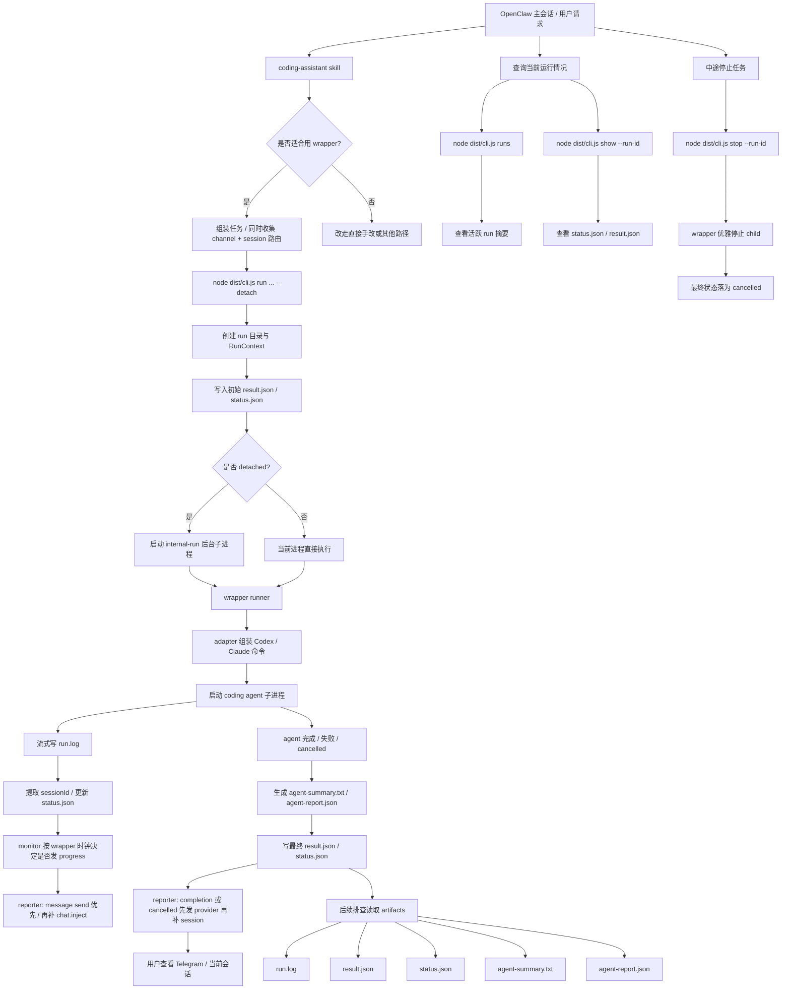

# coding-agent-wrapper

一个面向开发者的、可组合的 coding agent wrapper：把 Codex / Claude Code 这类编程代理包装成统一的后台任务执行单元，并提供一致的运行时产物、进度汇报、查询与中断控制能力。

它既可以：
- 被 **OpenClaw skill** 调用，作为聊天中的后台 coding 执行层
- 也可以被开发者 **直接通过 CLI** 调用，用在本地脚本、自动化流程或自定义编排器中

当前版本重点做好：
- detached 后台运行
- 统一 artifact 输出（`run.log` / `result.json` / `status.json`）
- 运行中 progress 通知
- active run 查询
- graceful stop / cancel

## 适用场景

适合以下场景：
- 你希望把长时间运行的 coding 任务放到后台执行，而不是一直占住当前终端/会话
- 你希望运行过程中有可观察的进度，而不是只在最后看结果
- 你希望任务结束后有结构化结果文件，而不是只靠控制台滚动日志
- 你希望可以查询当前有哪些 run 在执行，必要时中途优雅停止

不适合的场景：
- 只做一两行特别简单的本地改动
- 不需要后台运行、不需要结果落盘、不需要通知的短命令
- 你已经有一套更高层、协议化的任务调度/执行系统，并不需要这个中间层

## 核心能力

- 把长时间运行的 coding 任务放到后台执行，而不是一直占住当前会话
- 在任务执行过程中主动汇报进度，让用户知道任务还在推进
- 为每次运行保留结构化结果与日志，便于后续查看、追踪和排查
- 支持查看当前有哪些任务正在运行，以及查看单个任务的状态
- 支持在任务中途优雅停止，并把结果明确记为 `cancelled`
- 既可以作为 OpenClaw skill 的执行层使用，也可以直接作为 CLI 集成到别的自动化流程中

## 运行流程图



## 在 OpenClaw 中启用 repo 内置 skill

开始前，先在仓库根目录执行：

```bash
pnpm install
pnpm build
```

本仓库内置了一个与 wrapper 同步维护的 `coding-assistant` skill，目录位于：

```text
skills/coding-assistant/
```

如果你希望 OpenClaw 直接从这个仓库加载该 skill，需要在 `openclaw.json` 中加入额外的 skill 加载目录：

```json
{
  "skills": {
    "load": {
      "extraDirs": [
        "/path/to/coding-agent-wrapper/skills"
      ]
    }
  }
}
```

同时，通常还需要在 `openclaw.json -> skills.entries.coding-assistant.env` 中配置这个 skill 运行所需的环境变量。常见用途包括：

- coding agent 自身需要的环境变量（例如 Codex / Claude Code 所需配置）
- wrapper 的通知目标配置（例如默认通知 channel / target / account）

一个通用示意如下：

```json
{
  "skills": {
    "entries": {
      "coding-assistant": {
        "env": {
          "SOME_AGENT_ENV": "value",
          "ANOTHER_AGENT_ENV": "value",
          "NOTIFY_CHANNEL": "telegram",
          "NOTIFY_TARGET": "<chat-or-user-id>",
          "NOTIFY_ACCOUNT_ID": "default"
        }
      }
    },
    "load": {
      "extraDirs": [
        "/path/to/coding-agent-wrapper/skills"
      ]
    }
  }
}
```

启用后可用 `openclaw skills list` 检查 `coding-assistant` 是否来自 `openclaw-extra`。

## 使用方式

这个项目有两种主要使用方式：

### 方式 A：通过 OpenClaw skill 使用

如果你在 OpenClaw 中启用了 repo 内置 `coding-assistant` skill，那么上层 agent 可以直接通过 skill 来：
- 启动后台 coding 任务
- 决定是否开启 progress notifications
- 查询活跃 run
- 中途停止任务
- 在任务被中断后检查 git 工作区并询问用户是否保留改动

这种方式适合：
- 聊天驱动的任务执行
- 希望复用 skill 中已定义好的策略（progress cadence、stop 后 git 检查等）

### 方式 B：直接通过 CLI 使用

如果你不通过 OpenClaw skill，也可以直接调用 wrapper CLI。

#### 常见命令

前台运行一个 Codex 任务：

```bash
node dist/cli.js run \
  --agent codex \
  --cwd /path/to/repo \
  --task "Inspect the repository and summarize the next refactor step." \
  --label demo
```

后台运行：

```bash
node dist/cli.js run \
  --agent codex \
  --cwd /path/to/repo \
  --task "Fix the failing test and explain the root cause." \
  --label fix-tests \
  --detach
```

长任务启用 wrapper 控制的运行中汇报：

```bash
node dist/cli.js run \
  --agent codex \
  --cwd /path/to/repo \
  --task "Implement the feature, run validation, and fix follow-up issues if needed." \
  --label feature-work \
  --progress-start-after-seconds 120 \
  --progress-every-seconds 180 \
  --detach
```

中途停止一个后台 run：

```bash
node dist/cli.js stop \
  --run-id 20260311093830-stop-probe-v2
```

查看当前活跃 run：

```bash
node dist/cli.js runs
```

查看单个 run 的状态与结果：

```bash
node dist/cli.js show \
  --run-id 20260311093830-stop-probe-v2
```

查看某个 run 的日志尾部（也可省略 `<run-id>`，默认自动选最近任务：优先最新 running，否则最新任务）：

```bash
node dist/cli.js tail
node dist/cli.js tail -n 30
node dist/cli.js tail -f
node dist/cli.js tail 20260311093830-stop-probe-v2
node dist/cli.js tail 20260311093830-stop-probe-v2 -n 30
node dist/cli.js tail 20260311093830-stop-probe-v2 -f
```

输出会固定先打印：

```text
Run ID: 20260311093830-stop-probe-v2
Status: success (exit 0)

...recent log lines...
```

也支持给底层代理透传额外参数，在 `--` 后面填写：

```bash
node dist/cli.js run \
  --agent codex \
  --cwd /path/to/repo \
  --task "Add a small README section." \
  -- --model gpt-5-codex
```

### 通知路由策略

- 如果提供了 `notifyChannel + notifyTarget`，wrapper 会先执行 `message send`
- 如果同时还提供了 `notifySessionKey`，wrapper 会在 `message send` 之后再执行一次 `chat.inject`
- 这两个动作不会互相短路：即使 provider/channel 消息已发送成功，session 注入仍会继续尝试；反过来也一样
- 这样做是为了避免 Telegram / Discord / WhatsApp 与 webchat 同时打开时，只把完成消息注入到 session、却漏发到真实消息渠道
- `run.log` 会记录每一步的尝试顺序、单步 exit code / success，以及最终是否至少有一种通知成功

### CLI 参考

#### `run` 相关参数

- `--agent <codex|claude>`：选择底层代理
- `--cwd <path>`：任务工作目录
- `--task <text>`：要执行的任务描述
- `--label <text>`：可选标签，用于 runId 可读性
- `--detach`：后台运行
- `--progress-start-after-seconds <n>`：首条运行中汇报最早在启动后多少秒允许发送
- `--progress-every-seconds <n>`：运行中汇报的固定节奏间隔（由 wrapper 自己控制）
- `--output-root <path>`：结果输出根目录，默认是当前命令目录下的 `runs`
- `-- ...`：透传给底层代理命令的额外参数

#### 子命令

- `run`：启动一个新的 wrapper 任务
- `stop --run-id <id>`：请求优雅停止一个后台 run，成功时最终状态会落成 `cancelled`
- `runs`：列出当前活跃 run 的简要信息
- `show --run-id <id>`：查看某个 run 的 `status.json` / `result.json` 摘要
- `tail [run-id] [-n <count>] [-f]`：查看某个 run 的 `run.log` 尾部；省略 `run-id` 时默认选最近任务（优先最新 running，否则最新任务），输出会先显示 `Run ID` / `Status` 头部；默认会过滤 wrapper 自身的 `[wrapper] ...` 内部日志，可通过 `--include-wrapper` 显式打开

## 结果文件与运行状态

默认输出到：

```text
runs/<runId>/run.log
runs/<runId>/result.json
runs/<runId>/status.json
runs/<runId>/agent-summary.txt
runs/<runId>/agent-report.json
```

### `result.json`

`result.json` 是任务结束后的权威结果文件，至少包含：

- `runId`
- `agent`
- `cwd`
- `taskSummary`
- `startedAt`
- `finishedAt`
- `exitCode`
- `status`
- `logPath`
- `summary`

此外，运行中的 ownership / control 相关字段包括：

- `pid`：wrapper 进程 pid
- `childPid`：底层 Codex / Claude 子进程 pid
- `claimedAt`
- `terminationReason`
- `stopRequestedAt`
- `stopRequestedBy`

### `status.json`

`status.json` 是运行中状态快照，主要用于：
- progress 通知
- 活跃 run 查询
- 判断任务当前阶段

常见字段包括：
- `phase`
- `summary`
- `updatedAt`
- `sessionId`
- `reporting.lastReportAt`
- `reporting.reportCount`

### 其它产物

- `run.log`：完整原始执行日志；其中凡是 wrapper 自己写入的内部运行日志，约定统一以 `[wrapper]` 开头，便于 `tail` 与后续工具可靠过滤或显式展示
- `agent-summary.txt`：agent 留下的人类可读总结（如有）
- `agent-report.json`：agent 留下的结构化报告（如有）


## 二次开发指南

如果你想在这个项目上继续开发，建议先从下面这些入口理解结构：

- `src/cli.ts`：CLI 入口与子命令解析
- `src/runner.ts`：run 生命周期主流程
- `src/monitor.ts`：progress cadence 与最近活动提炼
- `src/reporter.ts`：通知发送
- `src/status.ts`：`status.json` 读写
- `src/stop.ts`：graceful cancellation
- `src/query.ts`：`runs` / `show` 查询能力
- `src/adapters.ts`：Codex / Claude 的命令适配层
- `skills/coding-assistant/`：与 wrapper 同步演进的 OpenClaw skill

建议的开发顺序通常是：
1. 先明确是要改 CLI 行为、运行态、通知策略还是 skill 策略
2. 优先保持 `result.json` / `status.json` 契约稳定
3. 改完后至少执行：

```bash
pnpm type-check
pnpm lint
pnpm build
```

## 设计说明

- 保持为普通 CLI，不做服务化
- 不引入数据库，不引入队列系统
- 不做 UI
- 结果细节以文件为准，通知只负责“唤醒”
- 适配层与运行层分开，便于后续增加更多 agent

## 当前限制

- 第一版没有实现任务队列、重试策略
- 当前默认不支持同一个 `cwd` 的并行 run；若 future 需要并行，应结合 git worktree（不同工作目录）单独设计，而不是绕过 single-flight
- 第一版没有统一抽象所有代理的结构化输出协议
- `Claude Code` 目前重点是命令拼装与运行骨架，深度适配仍待继续补充
- 后台任务由当前机器本地进程负责，不包含守护进程恢复能力

## 后续可扩展方向

- 增加更多 agent 适配器
- 增加结果 JSON 的更强结构化字段

## Credits

repo 内置的 `coding-assistant` skill 在设计与演进时参考了 OpenClaw 内置的 `coding-agent` 技能思路，并在此基础上补充了本项目的 wrapper、progress、query 和 cancellation 能力。
